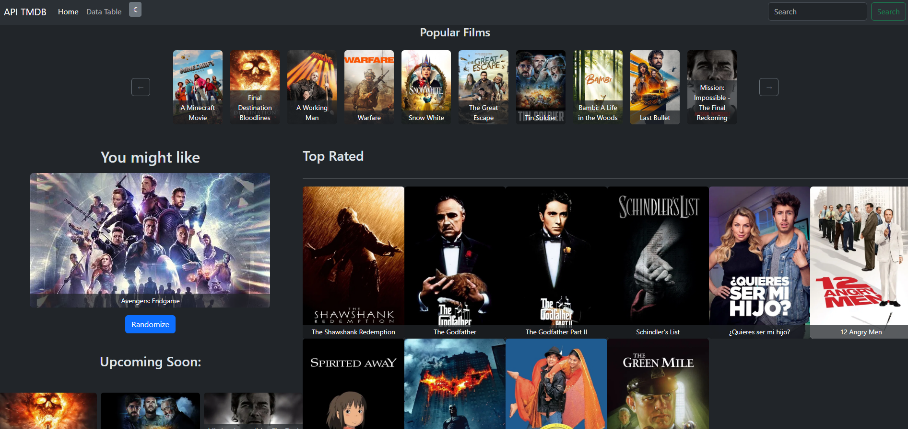
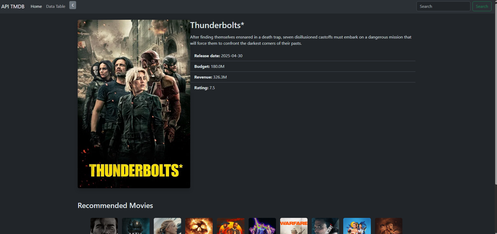
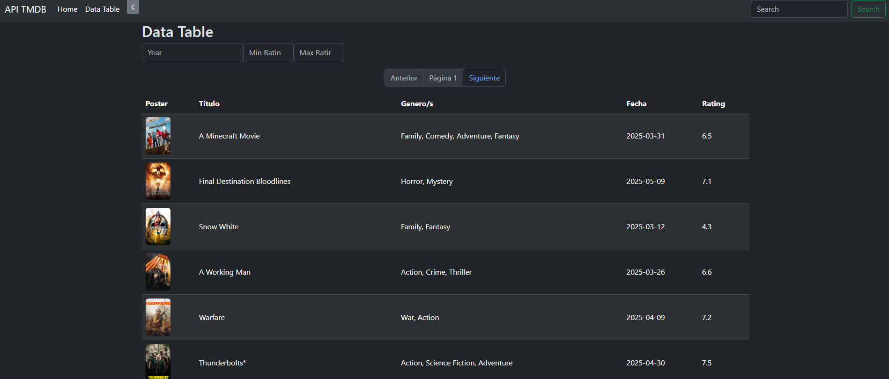

# 🎬 Angular TMDb Movie Browser

## 👤 oscarBarEs

**Name:** Óscar Barquilla Esteban

---

## 📖 Project Overview

This is a responsive Angular application created as part of the **VW DIGITAL:HUB Frontend Technical Test**. The app is a movie browser that interacts with the [TMDb API](https://www.themoviedb.org/documentation/api), allowing users to **list**, **search**, **sort**, **view**, and **interact** with movie data.

---

## 🚀 Getting Started

### 🛠 Prerequisites

- Node.js v18+
- Angular CLI v17+
- TMDb API Key (You can get one [here](https://www.themoviedb.org/settings/api))

### 📦 Installation

```bash
git clone https://github.com/oscarBarEs/Prueba-VW
cd angular-tmdb-app
npm install
````

### 🔐 API Key Setup (modificado)
This project already includes a personal TMDb API key, which is stored securely inside core/services/session.service.ts.

This service is responsible for generating and storing a session ID, which is required by the TMDb API to associate requests with a specific user session.

All subsequent API requests include this session as part of the communication with TMDb.


### ▶️ Running the App

```bash
ng serve
```

Then open [http://localhost:4200](http://localhost:4200)

---

## 🧠 Architecture & Module Overview

The app is structured using standalone components and modular separation of concerns.

### 📁 `src/app/modules`

| Module           | Description                                                          |
| ---------------- | -------------------------------------------------------------------- |
| **home**         | The main landing page. Displays featured movies and UI entry points. |
| **data-table**   | A table page to list and sort movies with filters.               |
| **movie-grid**   | Shows a reusable responsive grid of movie posters.                            |
| **movie-poster** | A reusable card component for displaying movie thumbnails and info.  |
| **movie-detail** | Displays detailed information about a selected movie on a secondary page.                |

---

## 🔎 Features

✅ List movies from TMDb

✅ Search movies by title

✅ Sort by popularity, date, or rating

✅ Click to view detailed movie info

✅ Fully responsive (grid/table switch for mobile)

✅ Dark/Light Mode

✅ Clean, maintainable structure with reusable components

---

## 📷 Screenshots

### 🏠 Home Page

> 

### 🎞 Movie Detail View

> 

### 📊 Data Table 
> 

---

## 🧩 Reusable Components

### `MoviePosterComponent`

Reusable visual component that displays an individual movie’s image and basic information.

### `DataTableComponent`

Layout component that displays a collection of MoviePoster items in a responsive grid format.

### `MovieDetailComponent`

Detailed viewer component for a selected movie.
Although it is a reusable and isolated component, it also functions as a full route-level page at /movie/:id, rendering extended details when accessed directly.

**Design Trade-offs:**
These components are designed to be simple but flexible. Some domain logic is embedded for this prototype stage, but can be abstracted further for larger apps.

---

## 🧪 Testing

Unit tests are included using **Jasmine** and **Karma**.

```bash
ng test
```

More test coverage (especially integration and E2E) is recommended for production readiness.

---

## ⚙️ Performance Optimizations

* Lazy loading of feature modules (`movie-grid`)
* Use of `Signals` for reactive performance without over-subscribing

---

## ♿ Accessibility

* Semantic HTML elements (`button`, `section`, `nav`, etc.)
* ARIA labels for interactive elements
---

## 🤖 AI Tool Usage

### Tools Used

* **ChatGPT** (OpenAI)
* **GitHub Copilot**

### Purpose

* Generated component scaffolding and CSS suggestions
* Provided draft README and refactoring tips
* Suggested architecture ideas (e.g., standalone component usage)

### Human Involvement

All AI suggestions were reviewed and manually integrated. Structural and architectural decisions were based on personal expertise, not automatic code generation.

---

## 🔍 Code Review Summary

* ✅ Component structure simplified using Angular 17 features
* ✅ Unused files removed
* ✅ File naming standardized
* ✅ Services encapsulated and simplified
---

## 🛠 Git Usage

This project followed a clean commit history using the following strategies:

* Feature-based branches
* Meaningful commit messages
* Pull request structure assumed (if team collaboration were in place)

---

## 📱 Responsive Design

* Grid view switches automatically on mobile
* Table view shown on desktop with full data visibility
* Layout managed with CSS Flexbox/Grid and Bootstrap

---

## 📌 Assumptions Made

* TMDb API key is publicly usable for demo purposes
* No authentication system was required
* Data mutation (e.g., editing/deleting) was out of scope as TMDb is read-only

---

## 📅 Future Improvements

* Add authentication and user profiles
* Allow user movie ratings 

---


